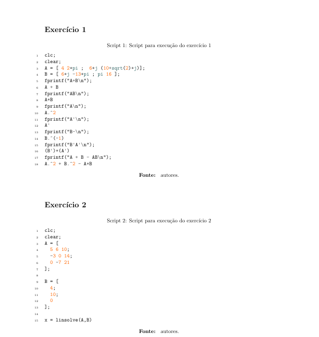

## Gerador de código Latex
---
Esse programa gera um relatório básico no latex com o seguinte template:



---

### Estrutura de pastas
O relatório é gerado com base na estrutura de pastas colocada dentro da pasta `exercicios`:

A estrutura de pastas:

```
exercicios
| - ex1
| - - | - ex1.c
| - ex2
| - - | - ex2_a.m
| - - | - ex2_b.m
```

Gera o seguinte código látex:

```tex
...
\section{Exercício 1}
...
% código contido no arquivo `ex1.c`

\section{Exercício 2}

\subsection{Letra a}
...
% código contido no arquivo `ex2_a.c`

\subsection{Letra b}
...
% código contido no arquivo `ex2_b.c`
...
```
---
### Nomenclatura de diretórios e arquivos
Para que o processamento dos arquivos seja realizado corretamente, a nomenclatura das pastas deve ser feita da seguinte maneira:

* Cada exercício deve ter uma pasta com seu nome seguindo o padrão:
    * Exercício 01: pasta 'ex1'
    * Exercício 02: pasta 'ex2'
* Cada código utilizado no arquivo deve estar contido na pasta correspondente e deve ser nomeado da seguinte forma:

    * Caso não haja subtópicos:
        - Código do exercício 01: ex1.c, ex1.m etc.
        - Código do exercício 02: ex2.c, ex2.m etc.
    * Caso haja subtópicos:
        - Código do exercício 01 letra a: ex1_a.c, ex1_a.m etc.
        - Código do exercício 01 letra b: ex1_b.c, ex1_b.m etc.
        - Código do exercício 02 letra a: ex1_a.c, ex1_a.m etc.

---
### Execução:

Para executar o script, as extensões dos arquivos a ser carregados devem ser passadas por parâmetro:

```python3 main.py -e m c java```

irá carregar arquivos matlab, c e java. 

---
### Arquivos suportados
| linguagem | extensão |
|:------:|:--------:|
| Java | `.java` |
| C | `.c, .cats, .hm, .idc, .w` |
| C++ | `.cpp, .c++, .cc, .cp, .cxx, .h, .h++, .hh, .hpp, .hxx, .inc, .inl, .ipp, .tcc, .tpp` |
| Matlab | `.m, .matlab` |
| C# | `.cs, .cake, .cshtml, .csx` |
| Javascript | `.js, ._js, .bones, .es, .es6, .frag, .gs, .jake, .jsb, .jscad, .jsfl, .jsm, .jss, .njs, .pac, .sjs, .ssjs, .sublime-build, .sublime-commands, .sublime-completions, .sublime-keymap, .sublime-macro, .sublime-menu, .sublime-mousemap, .sublime-project, .sublime-settings, .sublime-theme, .sublime-workspace, .sublime_metrics, .sublime_session, .xsjs, .xsjslib` |
| Python | `.py, .bzl, .cgi, .fcgi, .gyp, .lmi, .pyde, .pyp, .pyt, .pyw, .rpy, .tac, .wsgi, .xpy` |
| Tyepscript | `.ts, .tsx` |
---
### Código gerado:

Para visualizar o código gerado, verifique a pasta `saída`. Nela estará contido o arquivo `Tex` gerado.